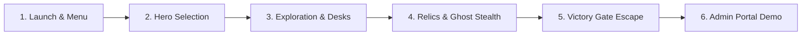

# 🎮 Khmer Spirit: The Haunted School
## Comprehensive Game Test Flow & Video Demo Voice-Over Script

---

## 📋 Executive Overview & Quick Reference
- **Game Title**: Khmer Spirit: The Haunted School (ខ្មោចលងក្នុងសាលា)
- **Engine & Architecture**: Pure Java 21 & JavaFX (No external game engine), Custom 60 FPS Game Loop, Shaded Fat JAR & Standalone Windows Distribution (`HauntedSchool.exe`).
- **Core Loop**: Character Selection ➔ Exploration & Stealth ➔ Educational Academic Desks (Math, Science, Coding/OOP, Networking, General Knowledge) ➔ Ancient Relic Collection ➔ Ghost Evasion ➔ Gate Escape & Victory.
- **Admin Portal**: Teacher Dashboard for question authoring, barrier toggling, reward management, and room configurations.

---

## 🧪 Part 1: Step-by-Step Game Test Flow (Recording & QA Flow)

Before recording the video demo, test each phase following this chronological path:

### Step 1: Launch & Main Menu Verification
1. **Launch**: Double-click `HauntedSchool.exe` (or run `powershell -ExecutionPolicy Bypass -File .\automate.ps1 -Run`).
2. **Audio & Title**: Confirm spooky ambient rain and traditional Khmer wind instruments play smoothly.
3. **Menu Buttons**: Test hover states on `NEW GAME`, `CONTINUE`, `SETTINGS`, and `TEACHER LOGIN`.
4. **Resolution**: Verify 1920x1080 scaling without letterboxing artifacts.

### Step 2: Character Selection Screen
1. Click **`NEW GAME`** or **`HERO SELECT`**.
2. **Hero Cards**:
   - Card 1: **វិច្ឆិកា (VICHEKA)** – Curious student investigating paranormal school rumors.
   - Card 2: **ចាន់ដា (CHANDA)** – Observant, high-intelligence student with sharp survival instincts.
   - Card 3: **ព្រះសង្ឃ (PREAH SONGK)** – Devoted Buddhist monk wielding sacred chants and spirit protection.
3. **Navigation Buttons**: Verify `◀ BACK`, `START GAME`, and `CONTINUE ▶` are in clean English with Cambodian temple border accents.
4. **Selection**: Click between cards to verify smooth scale animation and gold border selection glow. Select your preferred hero and press **`START GAME`**.

### Step 3: Exploration & Dual Navigation (WASD + Arrow Keys)
1. **Controls Verification**:
   - **Movement**: Test both **WASD** and **Arrow Keys** (Left, Right, Up, Down).
   - **Sprint**: Hold `Shift` to sprint; watch stamina bar deplete and smoothly regenerate.
   - **Interact**: Press `E` or `Space` near objects.
   - **Minimap**: Toggle `M` to show/hide the modern HUD radar minimap.
   - **Flashlight**: Press `F` to toggle the dynamic 2D lighting cone.

### Step 4: Academic Examination Desks (The 5 Categories)
1. Approach examination desks placed in classrooms.
2. Press `E` to trigger the examination terminal.
3. Verify the **modern category badges** and **difficulty indicators**:
   - 🏷 **Mathematics** (Easy / Medium)
   - 🏷 **Science** (Easy / Medium)
   - 🏷 **Coding (Java & OOP)** (Easy / Medium)
   - 🏷 **Networking** (Easy / Medium)
   - 🏷 **General Knowledge** (Easy / Medium)
4. Answer correctly: Verify sound effect, score bonus, and reward drop notification.

### Step 5: Item Pick-Up & Inventory Display
1. Walk over spawned items: Key Fragments, Holy Water, Lantern Oil, and Ancient Talismans.
2. Observe the **Modern Pick-Up Notification Banner**: Glowing border, item icon, rarity color, and sound cue.
3. Open Inventory: Check slots, stack counts, and descriptive lore tooltips.

### Step 6: Ghost AI & Stealth Evasion
1. Approach a hallway patrolled by an entity (**Ahp**, **Pret**, or **Ghost Teacher**).
2. Observe AI behavior:
   - **Patrol State**: Ghost moves along set waypoints.
   - **Alert State**: Proximity triggers heartbeat SFX and visual vignette darkening.
   - **Pursuit State**: Ghost enters line-of-sight chase.
3. Break line-of-sight behind classroom walls or use Holy Water / Monk Chants to repel the spirit.

### Step 7: Victory & Gate Escape
1. Combine the 3 Spirit Gate Keys collected from the master rooms.
2. Reach the Main Courtyard Gate.
3. Trigger the **Victory Sequence**:
   - Gate unlock animation.
   - Victory fanfare with Khmer traditional celebration music.
   - Score summary screen displaying total time, questions answered, and relics secured.

### Step 8: Admin & Teacher Portal
1. Return to Main Menu ➔ Click **`TEACHER LOGIN`**.
2. **Modern Buttons**: Check the updated `⚡ ENTER SYSTEM` (glowing amber) and `↩ RETURN TO MENU` (crimson slate) buttons with hover scaling.
3. **Login**: Enter default credentials (`admin` / `admin123`).
4. **Question Management**:
   - Click "Questions" tab.
   - Verify the **Question Writing Box**: Background is deep dark blue (`#0f172a`), typed text is crisp white (`#f8fafc`), completely readable.
   - Filter by Category (Coding, Math, Science, Networking, General Knowledge).

---

## 🎙️ Part 2: Timed Video Demo Script (Voice-Over + On-Screen Action)

> **Target Duration**: ~3 minutes 45 seconds  
> **Resolution**: 1080p 60 FPS (Record with OBS Studio or Windows Game Bar `Win + G`)  
> **Audio**: Low-volume game background music (15%) + Clear microphone voice-over (85%)

---

### ⏱️ Scene 1: Project Introduction & Main Menu (0:00 – 0:35)
- **Team Member**: **Presenter 1 (Team Leader / Project Intro)**
- **On-Screen Action**:
  - Show Windows Desktop ➔ Open game folder ➔ Double-click `HauntedSchool.exe`.
  - Game boots instantly into the Angkorian title screen with rain and Khmer traditional music playing.
  - Hover over menu buttons (`NEW GAME`, `SETTINGS`, `TEACHER LOGIN`).

> **🎙️ Voice-Over Script**:  
> *"Hello everyone, and welcome to our final OOP project: **Khmer Spirit: The Haunted School**!  
> Our game is a 2D survival-horror RPG uniquely built entirely in **pure Java 21 and JavaFX**, completely from scratch without external commercial game engines.  
> As you can see on the main menu, the game blends authentic Cambodian cultural folklore with engaging academic learning. Let’s jump straight into hero selection!"*

---

### ⏱️ Scene 2: Hero Selection & Modernization (0:35 – 1:10)
- **Team Member**: **Presenter 2 (Character System & UI)**
- **On-Screen Action**:
  - Click `NEW GAME`.
  - Show the 3 hero cards: **វិច្ឆិកា (Vicheka)**, **ចាន់ដា (Chanda)**, and **ព្រះសង្ឃ (Preah Songk)**.
  - Hover over each card to show the scale transition and golden glowing border.
  - Point out the English role and lore descriptions while retaining original Khmer character names.
  - Highlight the sleek English action buttons: `◀ BACK`, `START GAME`, and `CONTINUE ▶`.
  - Select **Vicheka** and click `START GAME`.

> **🎙️ Voice-Over Script**:  
> *"In the hero selection screen, players can choose between three distinct protagonists: **វិច្ឆិកា (Vicheka)**, the inquisitive student investigator; **ចាន់ដា (Chanda)**, an observant and analytical scholar; and **ព្រះសង្ឃ (Preah Songk)**, a devoted monk wielding spiritual protection chants.  
> Notice that all card lore, stats, and navigation buttons have been internationalized into English for global players, while proudly maintaining authentic Khmer names. Let's select Vicheka and enter the cursed academy!"*

---

### ⏱️ Scene 3: Gameplay, Controls & Modern Pick-up HUD (1:10 – 1:55)
- **Team Member**: **Presenter 3 (Game Mechanics & Visual Design)**
- **On-Screen Action**:
  - Spawn in the school courtyard / hallway.
  - Move character using **WASD**, then switch to **Arrow Keys** to show dual-navigation support.
  - Hold `Shift` to sprint down the dark corridor; toggle flashlight with `F`.
  - Toggle `M` to show the radar minimap.
  - Walk over an ancient relic: show the **Modern Item Pick-up Banner** popping up on the screen with sound effect.

> **🎙️ Voice-Over Script**:  
> *"Inside the haunted academy, the atmosphere is dark and intense. We designed fluid navigation supporting both **WASD** and **Arrow Keys**, paired with stamina-based sprinting and a dynamic 2D field-of-view flashlight.  
> In the top-right corner, we have a modernized minimap for spatial orientation. As we pick up items—like flashlight batteries and sacred amulets—our custom HUD immediately triggers a sleek, animated pick-up banner showing item rarity and inventory status."*

---

### ⏱️ Scene 4: Academic Desks & Educational Core (1:55 – 2:40)
- **Team Member**: **Presenter 4 (Educational System & Question Engine)**
- **On-Screen Action**:
  - Walk up to a glowing academic desk in a classroom.
  - Press `E` to open the Examination Terminal.
  - Show the new badge UI: Category (`Java & OOP`) and Difficulty (`Medium`).
  - Read question, select the correct option, click Submit.
  - Answer 1 more question in `Science` or `Mathematics`. Show positive feedback and score increase.

> **🎙️ Voice-Over Script**:  
> *"Education is the core beating heart of Khmer Spirit. Locked doors and spirit barriers require players to solve curriculum-aligned challenges at interactive desks.  
> Our question database features over 200 balanced Easy and Medium questions across five major categories: **Mathematics, Science, Coding with Java and OOP, Networking, and General Knowledge**.  
> Every correct answer purifies spiritual barriers, earns XP, and provides the key fragments needed to escape."*

---

### ⏱️ Scene 5: Ghost AI Encounter & Victory Escape (2:40 – 3:15)
- **Team Member**: **Presenter 5 (AI System & Game Finale)**
- **On-Screen Action**:
  - Enter the central hallway where a ghost (Ahp / Pret) patrols.
  - Flashlight flickers, screen edges darken (vignette), heartbeat sound intensifies.
  - Evade ghost around a pillar, reach the final school iron gates.
  - Use the assembled Spirit Gate Key to trigger the **Victory Sequence**.
  - Show the victory screen and celebration theme.

> **🎙️ Voice-Over Script**:  
> *"Survival is not guaranteed! The academy is stalked by folkloric entities like the Ahp and Pret. Our custom AI uses line-of-sight raycasting and sensory patrol nodes. If a ghost spots you, heartbeat SFX intensify and you must break sightlines to survive.  
> Once all keys are assembled, we reach the school exit. Unlocking the gate triggers our celebratory victory scene, rewarding the player for their intellect and courage!"*

---

### ⏱️ Scene 6: Teacher & Admin Management Portal (3:15 – 3:45)
- **Team Member**: **Presenter 1 / All Members (Architecture & Admin Tools)**
- **On-Screen Action**:
  - Return to Main Menu ➔ Click `TEACHER LOGIN`.
  - Point out the newly modernized glassmorphic buttons (`⚡ ENTER SYSTEM` and `↩ RETURN TO MENU`).
  - Enter `admin` / `admin123` ➔ Access the Admin Dashboard.
  - Go to **Question Management**: Click "Add New Question", click into the textarea to demonstrate the fixed dark-blue background (`#0f172a`) and bright white text (`#f8fafc`).
  - Show Category dropdown and search filters. Conclude video.

> **🎙️ Voice-Over Script**:  
> *"Lastly, we built an integrated **Teacher Administration Portal**.  
> The login tablet features modernized glassmorphic interactive buttons with animated hover feedback. Inside, educators can manage question pools, adjust room difficulty, and configure item spawns in real-time.  
> As you can see, the question authoring terminal is styled with high-contrast dark blue and crisp white typography for effortless content creation.  
> That concludes our demonstration of **Khmer Spirit: The Haunted School**. Thank you for watching!"*

---

## 👥 Team Presentation Part Allocation (For 5 Members)

| Member | Assigned Part | Key Topics & Code Areas |
| :--- | :--- | :--- |
| **Member 1 (Lead)** | **Intro & Admin Portal** | Architecture (Java 21, JavaFX, Fat JAR), Main Menu, Admin Login View & Authentication. |
| **Member 2** | **Hero Selection & Localization** | `CharacterScene.java`, `CharacterType.java`, Card scaling, English translation + Khmer naming. |
| **Member 3** | **Movement, Physics & Modern HUD** | Dual-key navigation (WASD/Arrows), Sprint stamina, Modern item pick-up banner, Minimap radar. |
| **Member 4** | **Educational Engine & Questions** | `EducationManager.java`, 5 Categories, Easy/Medium difficulty balancing, desk interaction. |
| **Member 5** | **Ghost AI, Stealth & Victory** | `Ghost.java`, Patrol/Pursuit states, line-of-sight math, vignette shaders, Victory sequence. |

---

## 💡 Tips for Recording the Best Demo
1. **Clean Screen**: Close background apps (Discord, Telegram, Chrome) to keep recording smooth at 60 FPS.
2. **Audio Levels**: Keep game volume in Windows volume mixer at around 20-25% so voice-over commentary sounds crisp and clear.
3. **Cursor Visibility**: Move the mouse smoothly to guide the viewer’s eye toward HUD elements and buttons before clicking.
